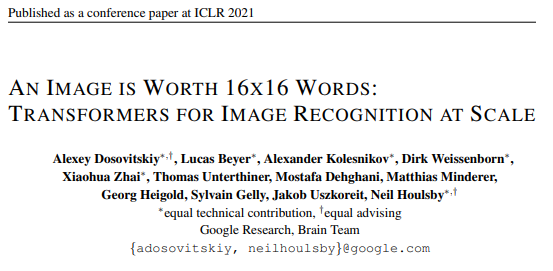
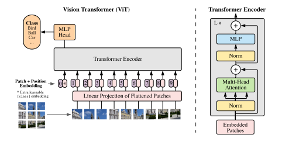

# Vision-Transformer Implementation from scratch
### Pytorch Implementation of ViT Model Presented on [An Image is Worth 16x16 Words: Transformers for Image Recognition at Scale](https://arxiv.org/pdf/2010.11929.pdf)
</img>

## Vision Transformer - Model Architecture
- Only Encoder from [Transformer](https://arxiv.org/pdf/1706.03762.pdf) is employed. This is not seq2seq model, but an image classifier.
- Classification is performed by one additional token, which is inserted in front of the input token sequence.
</img>

**Vision Transformer Models Variants**

**Comparisons with Image Classification Benchmarks**

